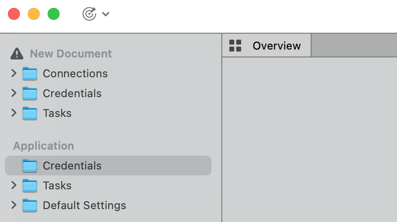
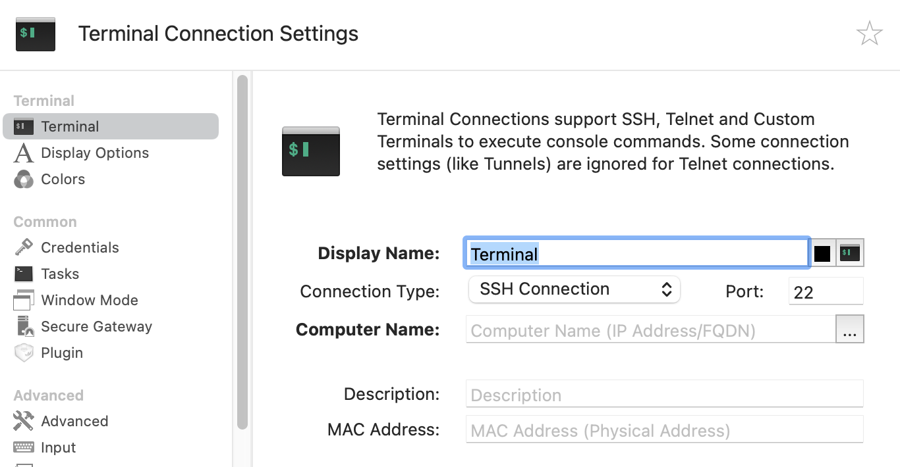
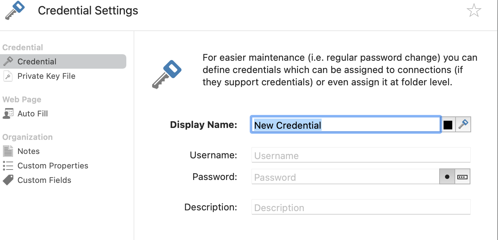
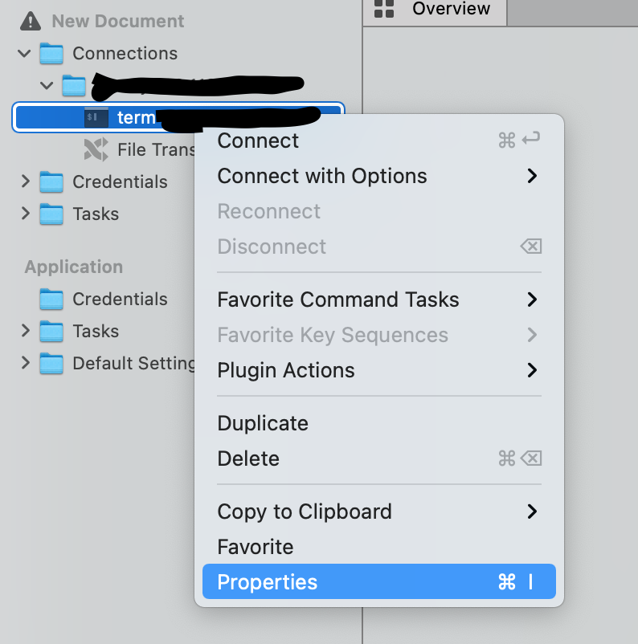
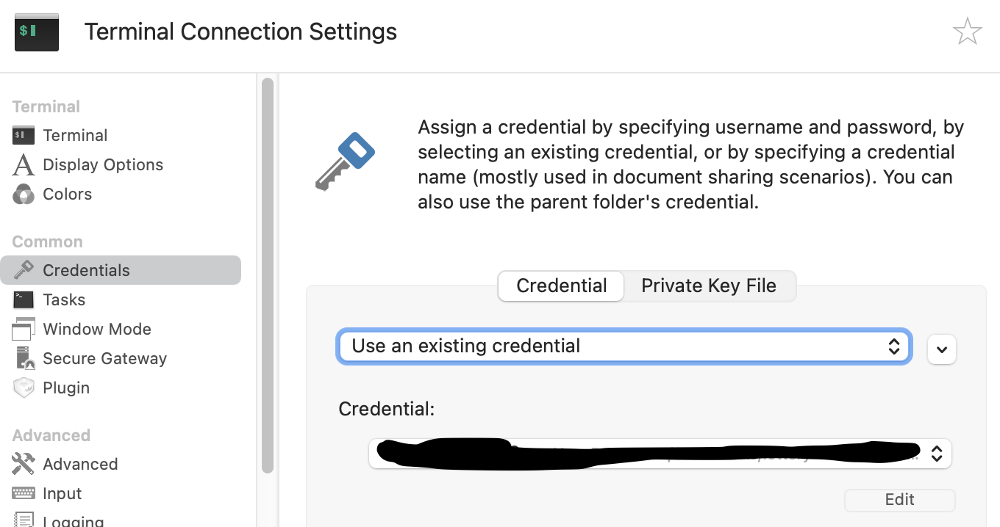

## Documnet 目录结构 

1. connnections 常用的插件链接  
2. credentials 保存的秘钥 
3. tasks 任务目录；  

## royal 使用  
1. new Documnet   免费版只能创建一个Documnet
2. 安装插件 常用的 Terminal; File Transfer 

## 添加 Terminal 
1. connnections 目录 add  选择Terminal 或 File Transfer(注意协议 默认ftp 但是没ftp服务 选sftp)
2. computer Name 为ip 地址  
3. 端口号和 ConnectionTyoe 可以根据实际情况更改 

## Connnections 下插件关联 Credentials 即关联密码  
1. 先添加Credentials 右键 add 输入自己的用户名和密码 

2. Terminal 右键 properties 然后选择 common下的 credentials   
 
 

